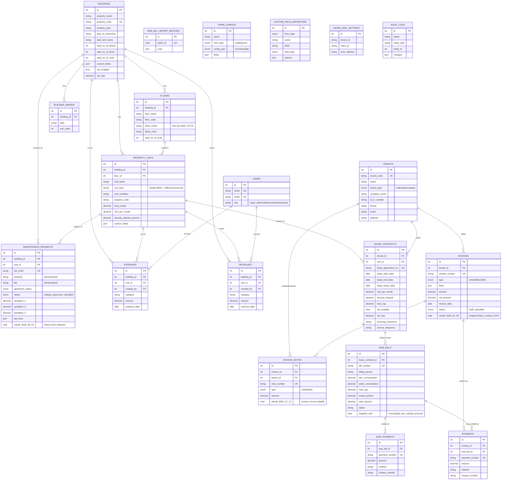

# Real Estate Schema — ERD

Reconstructed from all 49 migrations (reflects final state after every create/alter/rename/drop). Auth/queue/cache infra tables omitted — no business relationships.

> Open note: `unit_type` (`Office`/`Shop`/etc.) lives as a plain string on `property_units`, and `floors.block_name` is a free-text label, not a real entity. Pending confirmation with the real estate department on whether these need first-class modeling.

